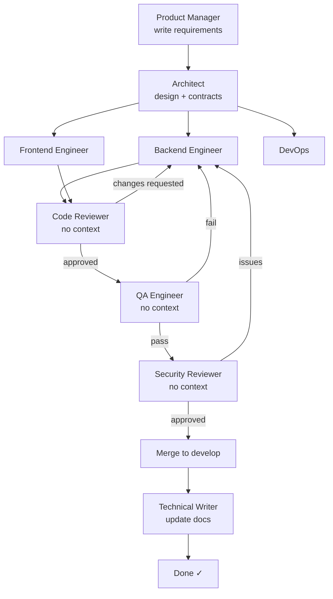
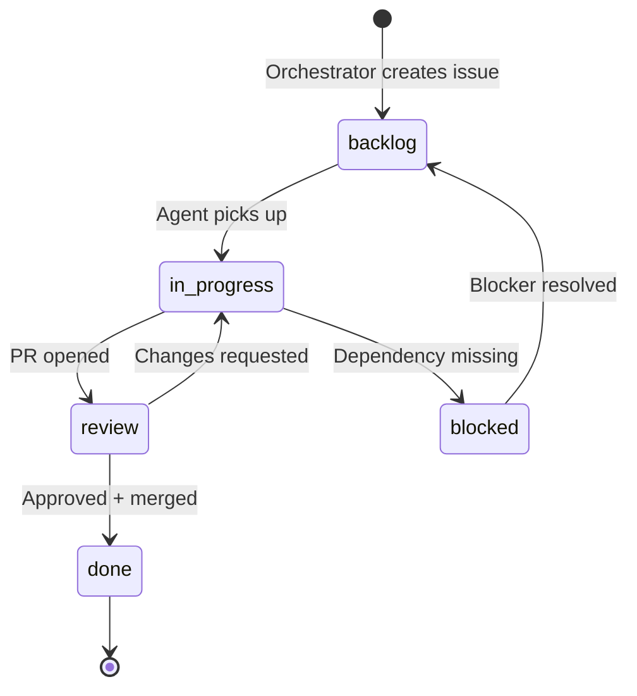
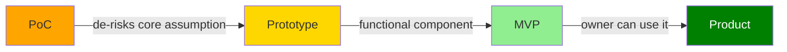

# Orchestration — Qwen3 TTS Server

> This document is maintained by the Orchestrator agent.
> Rendered to PDF via: `bash skills/swarm-dev/scripts/render-docs.sh`
> Last updated: (auto-update on each orchestrator run)

## Agent Pipeline

## Ticket Lifecycle

## Maturity Gate Flow

## Component Status

| Component | Maturity | Owner | Status |
|-----------|---------|-------|--------|
| (none yet) | — | — | — |

## Active Decisions

| # | Decision | Made by | Date |
|---|---------|---------|------|
| — | — | — | — |

## Pipeline Rules

1. No implementation without a contract (`contracts/<component>.yaml` must exist)
2. Critics (reviewer/qa/security) receive only the artifact — no backstory
3. Separation of concerns: cross-component imports are a blocking review finding
4. Every agent action is logged to `agent.log`
5. Maturity gates must be checked before closing any issue as done
