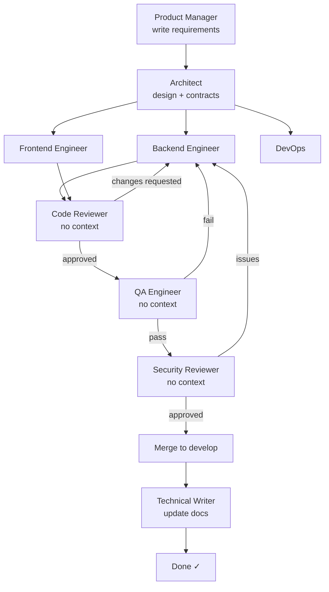
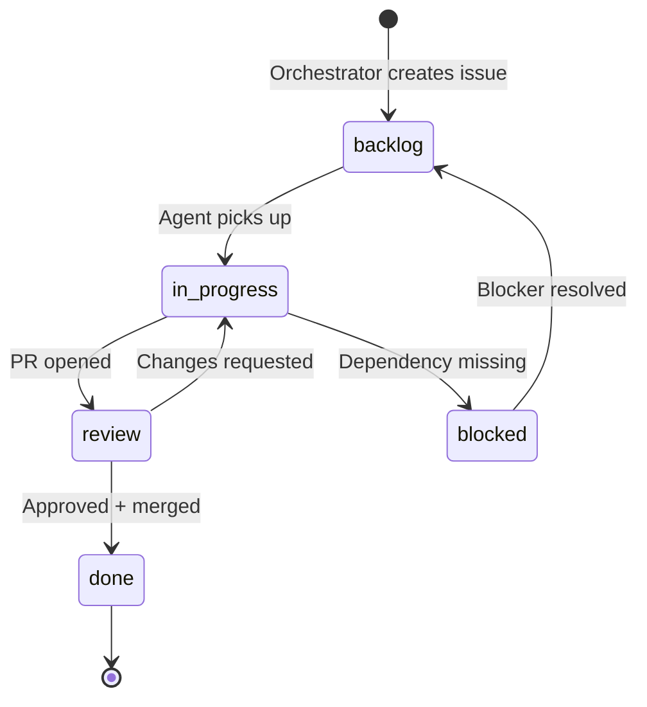

# Orchestration — Qwen3 TTS Server

> This document is maintained by the Orchestrator agent.
> Rendered to PDF via: `bash skills/swarm-dev/scripts/render-docs.sh`
> Last updated: (auto-update on each orchestrator run)

## Agent Pipeline



## Ticket Lifecycle



## Maturity Gate Flow


## Active Sprint

**Sprint 1: RunPod Preview Rendering**
- **Goal:** User can run a preview rendering for a character from the frontend
- **DoD:** Open character page → click Preview → hear audio (even on RunPod cold start)
- **Proposal:** `docs/sprint1-proposal.md`
- **Issues:** #10, #11, #12, #13 (13 points)
- **Status:** #10 ✅, #11 ✅, #12 ✅ (fix pushed), #13 ⬜ (QA not yet run)

## Component Status

| Component | Maturity | Owner | Status |
|-----------|---------|-------|--------|
| (none yet) | — | — | — |

## Active Decisions

| # | Decision | Made by | Date |
|---|---------|---------|------|
| — | — | — | — |

## Pipeline Rules (MANDATORY — NO EXCEPTIONS)

> **These rules are non-negotiable. "It's a simple task" is not a valid reason to skip any step.**
> **If a phase has no work, the agent says "no changes needed" and the phase still runs.**

### Strict Sprint Sequence

Every sprint follows this exact sequence. No step may be skipped:

```
1. PLAN      → Orchestrator writes sprint proposal (issues, sizing, goals)
2. APPROVE   → PO approves (or Orchestrator self-approves for pre-approved work)
3. ARCHITECT → Architect agent reviews design + contracts (even for "simple" changes)
4. BUILD     → Backend/Frontend/DevOps agents implement (parallel OK)
5. REVIEW    → Code Reviewer agent reviews every PR (no self-merges)
6. QA        → QA agent runs test verification (at MVP+ maturity)
7. MERGE     → Only after reviewer approval
8. REPORT    → Sprint review document written, posted to PO
```

### Hard Enforcement Rules

1. **No implementation without a contract** (`contracts/<component>.yaml` must exist)
2. **No PR merged without Code Reviewer agent approval** — orchestrator may NOT self-review
3. **Architect agent runs on every sprint** — even if output is "design unchanged, no action needed"
4. **Critics receive only the artifact** — no backstory, no context leak
5. **Every agent action is logged to `agent.log`** (JSONL)
6. **Maturity gates must be checked** before closing any issue
7. **Sprint review document is mandatory** — no sprint closes without one
8. **Separation of concerns** — cross-component imports are a blocking finding
9. **"Simple" is not an exemption** — the process exists precisely for tasks that seem simple

### Pre-Flight Checklist (Orchestrator reads this every session)

Before spawning ANY agent:
- [ ] Read `ORCHESTRATION.md` (this file) — check "Active Sprint" section
- [ ] Read `docs/sprint-N-proposal.md` for current sprint goal + DoD
- [ ] Read `agent.log` tail for recent context
- [ ] Identify which sprint phases are complete vs remaining
- [ ] Plan the full agent sequence before starting
- [ ] Do NOT skip phases because the task "feels simple"
- [ ] Sprint proposals MUST be persisted to `docs/sprint-N-proposal.md` — chat-only proposals get lost on compaction

### Anti-Patterns (things that have gone wrong before)

| Anti-pattern | What happened | Rule that prevents it |
|---|---|---|
| "Too simple for architect" | Skipped design review, missed interface issues | Rule 3: Architect runs every sprint |
| "I'll review it myself" | Self-merged PRs with bugs | Rule 2: Code Reviewer agent required |
| "Sprint review later" | Never written, context lost | Rule 7: Sprint review mandatory |
| "Just one agent is enough" | Skipped reviewer, QA | Strict sequence: all phases run |
| "Sprint goal in chat only" | Context compaction wiped it, orchestrator forgot the goal | Pre-flight: read `docs/sprint-N-proposal.md` |
