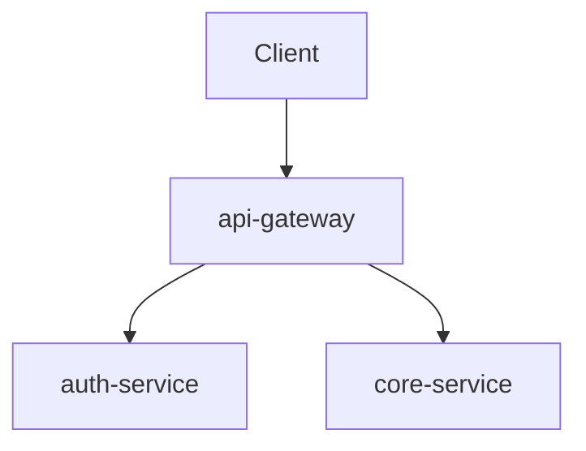

# Architecture

## Overview
[One paragraph describing the system and its purpose]

## Components

| Component | Maturity | Description |
|-----------|---------|-------------|
| example-service | poc | [Description] |

## Component Map

## Key Decisions
[Link to GitHub issues with `decision` label]
