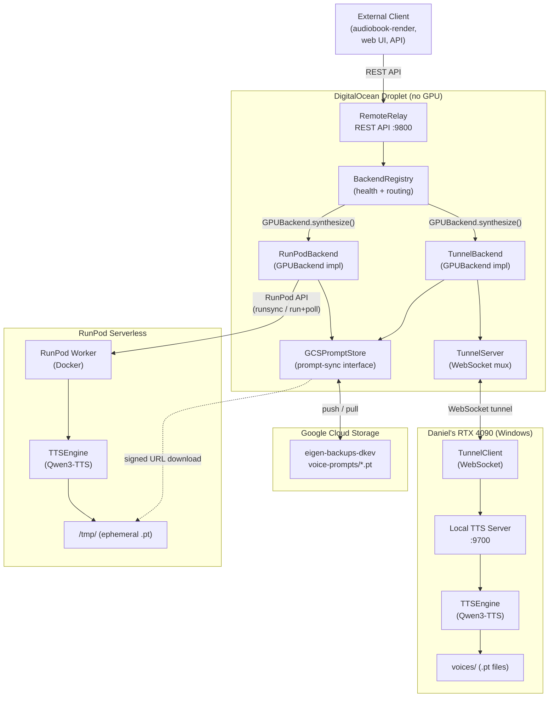
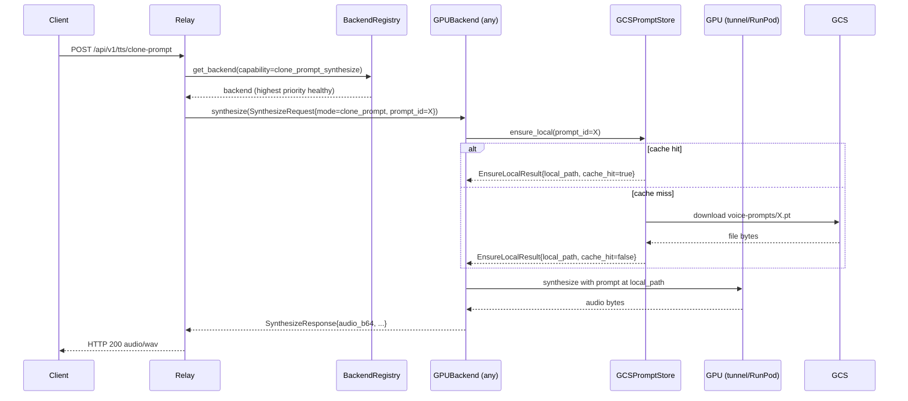
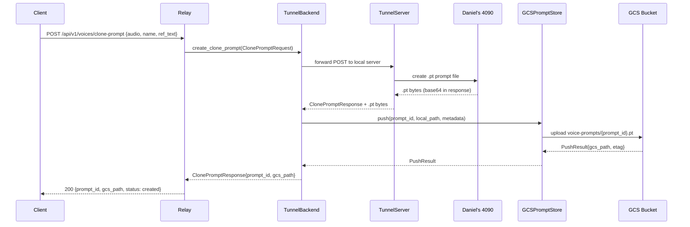
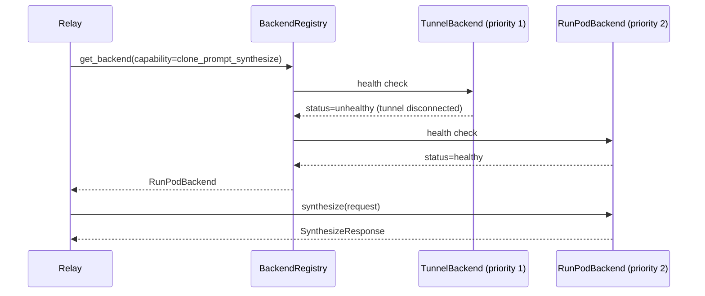

# Architecture

## Overview

Qwen3-TTS Server is a multi-tier system that exposes a unified TTS REST API
backed by one or more GPU machines. A stateless relay server (running on a
DigitalOcean droplet, no GPU) sits between clients and GPU backends. Backends
include Daniel's RTX 4090 connected via a persistent WebSocket tunnel,
RunPod serverless GPU workers, and future providers (Lambda Labs, Vast.ai, etc.).

Voice clone prompts (.pt files) are synchronized across backends via Google
Cloud Storage, eliminating the limitation where clone-prompt synthesis could
only run on Daniel's local machine.

---

## Components

| Component | Maturity | Description |
|-----------|----------|-------------|
| remote-relay | mvp | Stateless REST API server on the droplet. Routes requests to GPU backends via BackendRegistry. No GPU, no model weights. |
| backend-registry | design | Manages a pool of GPUBackend instances with health tracking, priority ordering, and capability-based routing. |
| tunnel-backend | mvp → design | Adapter wrapping the existing WebSocket tunnel to Daniel's RTX 4090. Implements GPUBackend interface. |
| runpod-backend | mvp → design | Adapter wrapping RunPodClient. Implements GPUBackend interface. |
| prompt-sync (GCSPromptStore) | design | Synchronizes voice clone prompt files via GCS bucket `eigen-backups-dkev`. |
| tts-engine | mvp | Qwen3-TTS model wrapper running on GPU machines. Unchanged from v1. |
| tunnel-server | mvp | WebSocket multiplexer on the droplet side of the tunnel. Unchanged from v1. |
| runpod-worker | mvp | Docker container deployed to RunPod. Unchanged from v1. |

---

## Component Map

---

## Request Flow (New Architecture)

---

## Prompt Sync Flow

---

## Failover Flow

---

## Key Decisions

| Decision | Choice | Rationale |
|----------|--------|-----------|
| Backend interface | Uniform `GPUBackend` abstract class | Eliminates `if tunnel: ... elif runpod: ...` in relay |
| Prompt distribution | GCS object storage (pull-on-demand) | Backends only download prompts they actually need; no pre-distribution |
| RunPod prompt access | Signed URL injection | RunPod workers are stateless; no persistent GCS credentials |
| Tunnel prompt push | Relay-side push after create | Tunnel machine has no GCS credentials; relay has the key file |
| Health probing | Passive (per-request) + active (background interval) | Avoids adding latency to every request |
| Failover | Priority list, capability-filtered | No round-robin; prefer tunnel (lowest latency), fall back to RunPod |
| Backwards compat | TunnelBackend wraps existing TunnelServer; RunPodBackend wraps existing RunPodClient | Zero rewrite of core GPU-side or RunPod logic |

---

## Upgrade Path from v1

The v1 relay had hardcoded routing logic:
- `_forward_to_local()` — always the tunnel
- `_forward_to_runpod()` — always RunPod
- `_forward_with_fallback()` — tunnel first, RunPod second
- `handle_synthesize_with_prompt()` — hard-coded to require tunnel (RunPod could not use .pt files)

In v2:
1. `TunnelBackend` and `RunPodBackend` are created at startup, replacing the direct `RunPodClient` and `TunnelServer` calls in the relay.
2. `BackendRegistry` replaces all `has_client` / `self.runpod` branches.
3. `GCSPromptStore` is injected into both backends at construction.
4. All route handlers call `registry.get_backend(...)` + `backend.synthesize(...)`.
5. Clone-prompt synthesis now works on **any** backend that has `clone_prompt_synthesize: true`.

No changes required to `TunnelServer`, `RunPodClient`, `TTSEngine`, or the RunPod worker handler. They are wrapped, not replaced.

---

## Non-Functional Requirements

| Requirement | Target | Notes |
|-------------|--------|-------|
| API latency (p99) | 200ms routing overhead | Synthesis time excluded (GPU-bound) |
| Availability | 99.9% | Achieved via RunPod fallback when tunnel offline |
| Clone prompt availability | Same as GCS SLA (99.9%+) | Prompts not lost if GPU machine reboots |
| Prompt sync latency | < 60s end-to-end | Upload after create; download before synthesize |
| Security | OWASP Top 10 | Signed URLs time-limited to 1h; GCS key never leaves droplet |
| Observability | Logs + debug events | BackendRegistry emits health events; PromptSync logs push/pull |
