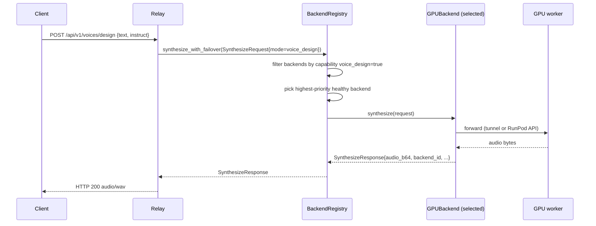
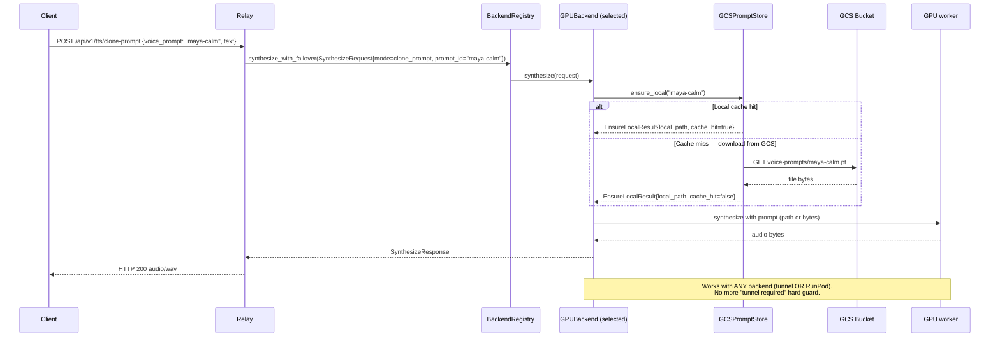
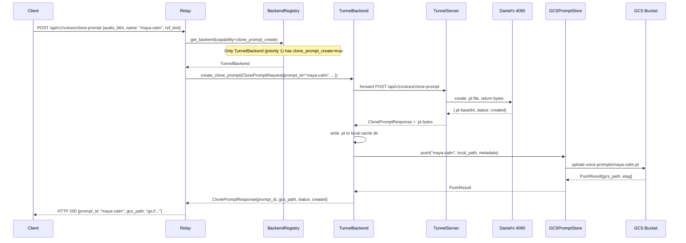
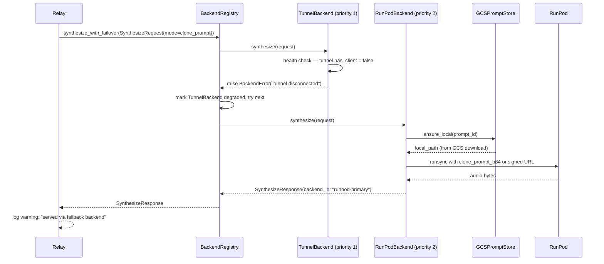

# GPU Backend Abstraction — Design Document

**Status:** Design  
**Branch:** `design/gpu-backend-abstraction`  
**Author:** Architect agent  
**Date:** 2026-02-28  

---

## 1. Problem Statement

The current relay (`server/remote_relay.py`) has **hardcoded routing logic** that knows
about exactly two backends — the WebSocket tunnel and RunPod — and branches between them:

```python
# Current relay — backend-specific code in routing logic (anti-pattern)
if self.tunnel_server.has_client:
    return await self._forward_to_local(...)
elif self.runpod:
    return await self._forward_to_runpod(...)
```

This creates two problems:

**Problem 1: Adding a third backend requires modifying relay core logic.**  
Lambda Labs, Vast.ai, or any future GPU-as-a-service requires adding new `elif` branches,
new client classes, new fallback logic. The relay grows unboundedly complex.

**Problem 2: Clone-prompt synthesis is locked to the tunnel.**  
Voice clone prompts (`.pt` files) are created and stored on Daniel's Windows machine.
RunPod workers start with an empty `voices/` directory. The relay explicitly refuses
RunPod for clone-prompt requests:

```python
# Current relay — hard guard that makes the system brittle
if not self.tunnel_server.has_client:
    return web.json_response({"error": "Clone-prompt synthesis requires the local GPU..."}, status=503)
```

When the tunnel is offline, **zero** clone-prompt synthesis is possible — even though
RunPod has a capable GPU sitting idle.

---

## 2. Solution Overview

Two abstractions solve both problems:

1. **`GPUBackend` interface** — uniform contract every backend implements. The relay
   calls `backend.synthesize(request)` with no knowledge of the backend type.

2. **`PromptSyncProvider` / `GCSPromptStore`** — object storage layer that syncs `.pt`
   files across backends. A prompt created on the tunnel is immediately available to
   RunPod (and any future backend).

Combined with a **`BackendRegistry`** that manages health, priority, and capability
filtering, the relay routing logic collapses to:

```python
# Target relay — clean, backend-agnostic routing
backend = self.registry.get_backend(mode=request.mode)
return await backend.synthesize(request)
```

---

## 3. `GPUBackend` Interface

### 3.1 Design Principles

- **Uniform**: same method signatures regardless of backend type.
- **Asynchronous**: all methods are `async def`, matching existing aiohttp event loop.
- **Self-describing**: backends declare their `Capabilities` at construction time;
  the registry never probes whether a backend can do something — it checks the capability flag.
- **Error-safe**: `health()` must never raise. All other methods raise typed exceptions
  (`BackendError` subclasses) that the registry converts to appropriate HTTP responses.

### 3.2 Abstract Class (Python pseudocode)

```python
from abc import ABC, abstractmethod

class GPUBackend(ABC):
    backend_id: str         # unique instance identifier
    backend_type: str       # "tunnel" | "runpod" | "lambda" | "vast"
    priority: int           # lower = preferred (1 = highest priority)
    capabilities: Capabilities

    @abstractmethod
    async def health(self) -> HealthResponse: ...

    @abstractmethod
    async def synthesize(self, request: SynthesizeRequest) -> SynthesizeResponse: ...

    @abstractmethod
    async def list_voices(self) -> list[VoiceInfo]: ...

    @abstractmethod
    async def create_clone_prompt(self, request: ClonePromptRequest) -> ClonePromptResponse: ...

    @abstractmethod
    async def delete_clone_prompt(self, prompt_id: str) -> DeletePromptResponse: ...

    @abstractmethod
    async def list_clone_prompts(self, character: str = None, tag: str = None) -> list[ClonePromptInfo]: ...
```

### 3.3 Capabilities

Capabilities are declared at construction, not discovered at runtime:

```python
@dataclass
class Capabilities:
    voice_design: bool = True
    custom_voice: bool = True
    clone: bool = True
    clone_prompt_synthesize: bool = True
    clone_prompt_create: bool = False  # Conservative default
    batch: bool = False
```

The relay (via `BackendRegistry`) uses capabilities to filter eligible backends before
routing. A request for clone-prompt synthesis will never be routed to a backend with
`clone_prompt_synthesize=False`.

### 3.4 Existing Backends as Adapters

Both existing backends require **zero changes** to their core logic:

#### `TunnelBackend`

```
TunnelBackend(GPUBackend)
  ├── wraps: TunnelServer (unchanged)
  ├── synthesize() → calls self.tunnel_server.send_request(...)
  ├── create_clone_prompt() → tunnel call + prompt_store.push(.pt bytes)
  └── capabilities: all True (full-featured GPU)
```

`TunnelBackend.synthesize()` is a thin adapter around the existing
`_forward_to_local()` logic, repackaged as a method that returns a `SynthesizeResponse`
instead of a `web.Response`. The relay converts `SynthesizeResponse → web.Response`
in a single centralized place.

#### `RunPodBackend`

```
RunPodBackend(GPUBackend)
  ├── wraps: RunPodClient (unchanged)
  ├── synthesize() → calls self.runpod.runsync(...)
  ├── synthesize(mode=clone_prompt) → calls prompt_store.ensure_local() → passes
  │   .pt file content in RunPod request body
  └── capabilities: clone_prompt_create=False (stateless worker)
```

`RunPodBackend.synthesize()` with `mode=clone_prompt` is the key improvement:
instead of failing with "prompt not found", it first fetches the prompt from GCS.
The RunPod worker receives the prompt bytes (base64-encoded in the request body)
and loads them into `/tmp/` for synthesis. No worker-side changes are needed if
the handler already accepts a `clone_prompt_b64` field in the request payload
(or the relay can pass a signed GCS URL).

---

## 4. `BackendRegistry`

### 4.1 Responsibilities

- Maintain a list of registered `GPUBackend` instances.
- Track health status per backend (polled in background, refreshed on-demand).
- Route requests to the highest-priority healthy backend that has the required capability.
- Automatically try the next backend on failure (failover).

### 4.2 Registry Pseudocode

```python
class BackendRegistry:
    def __init__(self, backends: list[GPUBackend], prompt_store: PromptSyncProvider):
        # backends sorted by priority (lower priority number = higher preference)
        self._backends: list[GPUBackend] = sorted(backends, key=lambda b: b.priority)
        self._health: dict[str, HealthResponse] = {}
        self.prompt_store = prompt_store

    def get_backend(self, mode: SynthesisMode) -> GPUBackend:
        """Return highest-priority healthy backend that supports mode.
        Raises NoBackendAvailable if none qualify.
        """
        for backend in self._backends:
            if not self._has_capability(backend, mode):
                continue
            health = self._health.get(backend.backend_id)
            if health and health.status == "unhealthy":
                continue
            return backend
        raise NoBackendAvailable(f"No backend available for mode={mode}")

    async def synthesize_with_failover(self, request: SynthesizeRequest) -> SynthesizeResponse:
        """Try backends in priority order until one succeeds."""
        last_error = None
        for backend in self._eligible_backends(request.mode):
            try:
                return await backend.synthesize(request)
            except BackendError as e:
                logger.warning("Backend %s failed: %s — trying next", backend.backend_id, e)
                self._mark_degraded(backend.backend_id)
                last_error = e
        raise NoBackendAvailable(f"All backends failed: {last_error}")

    async def _background_health_loop(self, interval_s: int = 30):
        """Periodic health probes for all backends."""
        while True:
            await asyncio.sleep(interval_s)
            for backend in self._backends:
                result = await backend.health()
                self._health[backend.backend_id] = result
```

### 4.3 Configuration

Backend registration happens at relay startup via config:

```yaml
# config.yaml (new section)
backends:
  - type: tunnel
    id: daniel-4090
    priority: 1

  - type: runpod
    id: runpod-primary
    priority: 2
    endpoint_id: ${RUNPOD_ENDPOINT_ID}
    api_key: ${RUNPOD_API_KEY}
```

This eliminates the current pattern where RunPod is conditionally initialized based
on whether `RUNPOD_ENDPOINT_ID` is set — instead, the registry simply has an empty
list if no RunPod config exists.

---

## 5. `PromptSyncProvider` / `GCSPromptStore`

### 5.1 Core Concept

Voice clone prompts are **PyTorch tensors** serialized with `torch.save()` to `.pt` files.
Currently these files live only on Daniel's GPU machine. The GCSPromptStore treats GCS
as the authoritative store; local disk is a read-through cache.

```
Write path: GPU creates .pt → relay uploads to GCS
Read path:  relay checks local cache → miss? download from GCS → serve to backend
```

### 5.2 Interface

```python
class PromptSyncProvider(ABC):
    @abstractmethod
    async def push(self, prompt_id: str, local_path: str, metadata: PromptMetadata) -> PushResult: ...

    @abstractmethod
    async def pull(self, prompt_id: str, force: bool = False) -> PullResult: ...

    @abstractmethod
    async def ensure_local(self, prompt_id: str) -> EnsureLocalResult: ...

    @abstractmethod
    async def list(self, character: str = None, tag: str = None) -> list[PromptRecord]: ...

    @abstractmethod
    async def delete(self, prompt_id: str, delete_local: bool = True) -> DeleteResult: ...

    @abstractmethod
    async def exists(self, prompt_id: str) -> ExistsResult: ...

    @abstractmethod
    async def get_signed_url(self, prompt_id: str, ttl_seconds: int = 3600, method: str = "GET") -> SignedUrlResult: ...
```

### 5.3 GCSPromptStore Implementation Notes

- Uses `google-cloud-storage` Python SDK (`google.cloud.storage`).
- Service account credentials loaded from `.secrets/gcloud-service-account.json`
  (already on the droplet). Key is loaded once at startup.
- GCS object name = `voice-prompts/{prompt_id}` (no `.pt` extension in the key — the
  prompt_id itself may or may not include it; the store normalizes).
- Local cache directory: `~/.cache/qwen3-tts/voice-prompts/` (configurable via env var
  `QWEN3_PROMPT_CACHE_DIR`). Created on first use.
- `ensure_local()` is the hot path — must be fast on cache hit (stat check only).

### 5.4 Credential Distribution

| Backend | GCS Credential Strategy |
|---------|------------------------|
| TunnelBackend | **Relay-side push**: after create_clone_prompt, relay calls push() with bytes returned by the tunnel. The relay holds the GCS key. The GPU machine never touches GCS. |
| RunPodBackend | **Signed URL injection**: relay calls get_signed_url(prompt_id, method="GET"), injects URL into RunPod request body. Worker downloads file to /tmp/, no credentials needed. |
| Lambda (future) | **Env injection**: GOOGLE_APPLICATION_CREDENTIALS_JSON passed as env var at instance launch. Backend pushes/pulls independently. |
| Vast.ai (future) | **Signed URL injection** (same as RunPod, ephemeral workers). |

The relay's GCS service account key (`dkev-api-account@alpine-zodiac-422307-h6.iam.gserviceaccount.com`)
never leaves the droplet. All credential distribution to untrusted backends uses
short-lived signed URLs (default 1 hour TTL).

---

## 6. End-to-End Request Flows

### 6.1 Standard Synthesis (voice_design, clone, custom_voice)



### 6.2 Clone-Prompt Synthesis (the key fix)



### 6.3 Clone-Prompt Creation + GCS Upload



### 6.4 Automatic Failover



---

## 7. Relay Routing Refactor

### 7.1 Before (v1)

```python
class RemoteRelay:
    def __init__(self, config):
        self.tunnel_server = TunnelServer()
        self.runpod = RunPodClient(...)  # Optional, None if not configured

    async def handle_synthesize_with_prompt(self, request):
        if not self.tunnel_server.has_client:        # ← hardcoded backend check
            return web.json_response({"error": "Clone-prompt requires local GPU"}, 503)
        body = await request.text()
        return await self._forward_to_local("POST", "/api/v1/tts/clone-prompt", body=body)

    async def _forward_with_fallback(self, method, path, body, ...):
        if self.tunnel_server.has_client:             # ← hardcoded routing
            return await self._forward_to_local(...)
        elif self.runpod:                             # ← hardcoded routing
            return await self._forward_to_runpod(...)
        else:
            return web.json_response({"error": "No GPU backend"}, 503)
```

### 7.2 After (v2)

```python
class RemoteRelay:
    def __init__(self, config, registry: BackendRegistry):
        self.registry = registry   # injected — no knowledge of backend types

    async def handle_synthesize_with_prompt(self, request):
        auth_error = await self._require_auth(request)
        if auth_error:
            return auth_error
        body = await request.json()
        synth_request = SynthesizeRequest(
            mode=SynthesisMode.CLONE_PROMPT,
            text=body["text"],
            clone_prompt_params=ClonePromptParams(prompt_id=body["voice_prompt"]),
        )
        try:
            result = await self.registry.synthesize_with_failover(synth_request)
            return _response_from_synth(result)
        except NoBackendAvailable as e:
            return web.json_response({"error": str(e)}, status=503)

    # All route handlers follow the same pattern — no backend-specific branches
```

The relay becomes a **thin HTTP adaptor**: validate auth, parse request, delegate to
registry, serialize response. All routing intelligence lives in `BackendRegistry`.

---

## 8. Backwards Compatibility

The design is fully backwards-compatible. No existing component requires rewriting:

| Component | Change Required | Notes |
|-----------|----------------|-------|
| `TunnelServer` | None | TunnelBackend wraps it via composition |
| `RunPodClient` | None | RunPodBackend wraps it via composition |
| `TTSEngine` | None | Runs on GPU machines, untouched |
| RunPod worker handler | Minor (add `clone_prompt_b64` field support) | Optional if using signed URL approach |
| `remote_relay.py` route handlers | Refactor only (no logic change) | Same endpoints, same responses |
| `auth.py` | None | |
| `tunnel.py` | None | |
| API contract (`relay-api.yaml`) | Additive only (new response fields) | Existing clients unaffected |
| Client code | None | Same REST endpoints, same response shapes |

The tunnel and RunPod handlers continue to use `TunnelServer` and `RunPodClient`
internally. The abstraction lives in the relay layer only.

---

## 9. Implementation Roadmap

This document covers design only. The implementation order is:

1. **Phase 1**: `GCSPromptStore` — implement and unit-test with mocked GCS.
   This unblocks everything else. (~1 day)

2. **Phase 2**: `GPUBackend` abstract class + data classes
   (`SynthesizeRequest`, `SynthesizeResponse`, `Capabilities`, etc.) (~half day)

3. **Phase 3**: `TunnelBackend` and `RunPodBackend` adapters wrapping existing clients.
   (~1 day)

4. **Phase 4**: `BackendRegistry` with health probing and failover. (~1 day)

5. **Phase 5**: Refactor `RemoteRelay` route handlers to use the registry. (~1 day)

6. **Phase 6**: Integration test — tunnel offline, create prompt via tunnel,
   synthesize via RunPod. (~1 day)

Total estimated effort: ~5-6 days for one backend engineer.

---

## 10. Open Questions

| # | Question | Impact | Proposed Answer |
|---|----------|--------|----------------|
| 1 | How does TunnelBackend get the .pt bytes back from the GPU? | High | The local TTS server already returns .pt content as base64 in the clone-prompt response. If not, add a `GET /api/v1/voices/clone-prompt/{name}/download` endpoint to the local server. |
| 2 | RunPod worker: signed URL or base64 bytes in request body? | Medium | Signed URL preferred — avoids duplicating file data in transit. Requires RunPod worker to add a download step before synthesis. |
| 3 | How does list_clone_prompts work for TunnelBackend when tunnel is offline? | Low | Fall back to GCS list — if tunnel is down, show GCS-known prompts with `local_cached=false`. |
| 4 | What happens if GCS is unavailable during push? | Medium | Retry 3x with backoff. If still failing, log error and return success to client (prompt was created locally — GCS sync is best-effort in v1). |
| 5 | Cache invalidation: prompt updated on one backend, stale on another? | Low | Not supported in v1. Each prompt_id is immutable once created (overwrite = new push, new cache invalidation event). Future: add ETag comparison in ensure_local(). |

---

## 11. Security Notes

- GCS service account key (`dkev-api-account@...`) lives only on the droplet at
  `.secrets/gcloud-service-account.json`. It is NOT distributed to GPU backends.
- RunPod workers receive signed URLs (HTTPS, max 1h TTL) for specific prompt files.
  Compromise of a signed URL allows downloading one file for up to 1 hour — acceptable risk.
- Voice prompt files are not sensitive by nature (they are model tensors, not raw audio).
  Standard GCS object-level access logging should be enabled for audit purposes.
- The `eigen-backups-dkev` bucket already has full control granted to the service account.
  No bucket policy changes are needed.
